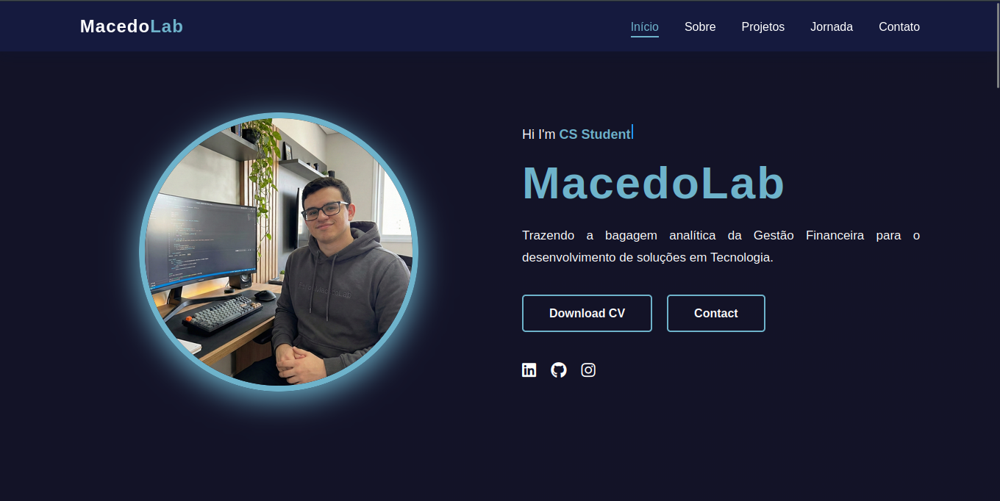

# MacedoLab - Portfólio Pessoal 🌐

  

 

Bem-vindo ao repositório do meu site pessoal!
Este projeto apresenta minha transição de carreira da **Gestão Financeira** para a **Ciência da Computação**, exibindo meus projetos, habilidades e jornada profissional.

---

## 🚀 Sobre o Projeto

Este portfólio foi customizado para refletir minha identidade profissional ("MacedoLab"), focada na intersecção entre análise de negócios e desenvolvimento de software.

**Principais Seções:**
- **Home:** Apresentação inicial.
- **Sobre:** Minha história de transição de carreira e soft skills.
- **Projetos:** Meus experimentos e códigos (Python, Web, etc.).
- **Jornada:** Linha do tempo da minha experiência financeira e formação acadêmica.
- **Contato:** Canais para networking profissional.

🔗 **Acesse o site online: https://macedolab.github.io/Portfolio/

---

## 🛠 Tecnologias Utilizadas

- **HTML5** (Estrutura Semântica)
- **CSS3** (Estilização e Responsividade)
- **JavaScript** (Interatividade e Animações)

---

## 📜 Créditos e Licença

Este site foi desenvolvido utilizando como base o template open-source criado por **[Amine Hamzaoui](https://github.com/Saboo24)**.

**Modificações realizadas por Felipe Macedo Lima:**
- Reestruturação completa de conteúdo e copy.
- Adaptação da paleta de cores para identidade visual Dark/Navy Blue.
- Personalização de seções para foco em transição de carreira (Finance -> Tech).
- Otimização de links e privacidade.

Este projeto respeita a licença original (veja o arquivo `LICENSE`).

---

## 📬 Contato

- **Email:** contato.macedolab@gmail.com
- **LinkedIn:** [Felipe Macedo Lima](https://www.linkedin.com/in/felipe-m-l/)
- **GitHub:** [MacedoLab](https://github.com/MacedoLab)
- **Instagram:** [@MacedoLab](https://instagram.com/FelipeMacedoLab)

---

  Desenvolvido por <strong>Felipe Macedo Lima</strong> 🚀

